# Streets of Rage — Dreamcast port and remaster

A native Dreamcast (SH-4, KallistiOS) port of Streets of Rage 1, built from the
original game's code rather than an emulator, with an optional enhanced
graphics mode on top.

You need your own copy of the ROM. Nothing derived from it is in this repository.

## Features

**The original game**, statically translated from the 68000 code to run
natively on the SH-4, with the original music, sound effects and timing, two
players and all eight rounds. 640×480 output.

**Enhanced graphics**, switchable at any time ([docs/REMASTER.md](docs/REMASTER.md)):

- **2x art** for every player, enemy, boss, weapon, item and effect in all
  eight rounds, with anti-aliased edges and smooth shading. Any frame can be
  replaced with your own hand-drawn art.
- **Dynamic lighting.** Shop windows, neon, lamps and fire in the backdrop
  become light sources. Characters are lit from the side the light is on, with
  shading across their body and a rim of light on the lit edge; fire, the
  bazooka's flame and hit sparks light what is near them.
- **Shadows** cast on the ground from those lights, swinging round and
  lengthening as a character walks past a window, plus a contact shadow that
  lifts in a jump. Light spills onto the ground below the wall.
- **Particles**: embers from fire, sparks and smoke from the bazooka, bursts
  from hits.
- **Weather**, per round: rain in two parallax sheets with splashes, wet
  ground reflecting the characters and the lights, haze and mist, light shafts
  through the fog, and lightning that flashes the scene and throws its own
  shadow. Rain on the street, the bridge and the lift; steam in the factory;
  nothing indoors.
- **Smooth animation**: in-between poses between the game's own animation
  frames.
- A remastered title screen.

Each of these is its own switch in the options menu.

**Cheats**: start at any round, choose lives, infinite lives, health and
specials.

## Screenshots

<p align="center">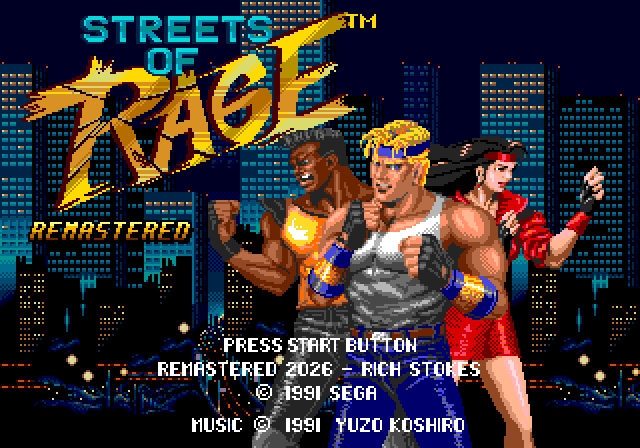</p>

The same frame of Round 1, drawn both ways. The options menu switches between
them at any time.

<table>
<tr>
<td align="center">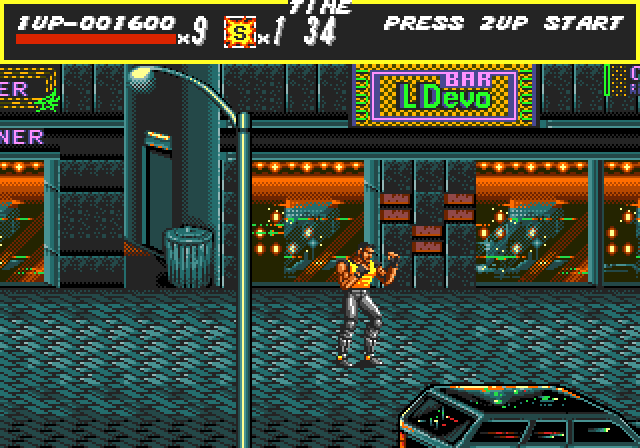<br><sub><b>Original</b></sub></td>
<td align="center">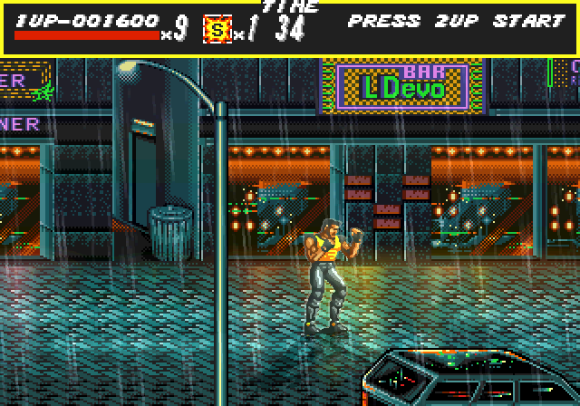<br><sub><b>Enhanced</b>: 2x art, dynamic lighting, weather</sub></td>
</tr>
</table>

<p align="center">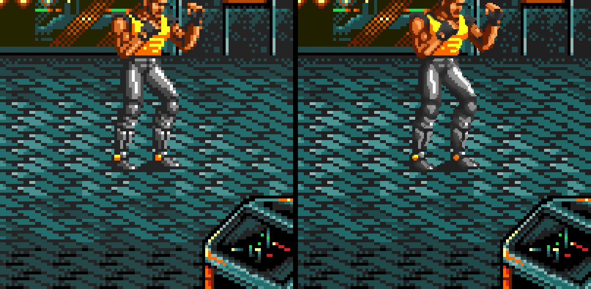<br><sub>Up close: the original pixels and the generated 2x art (lighting and weather off)</sub></p>

<table>
<tr>
<td align="center">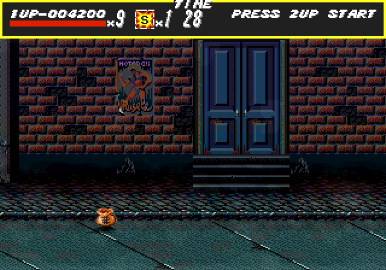<br><sub><b>Dynamic lighting</b>: the police special's fire lights the street and the characters, with embers</sub></td>
<td align="center">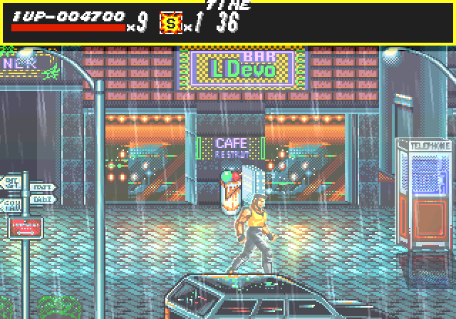<br><sub><b>Weather</b>: lightning flashes the scene and throws its own shadow over the wet street</sub></td>
</tr>
<tr>
<td align="center">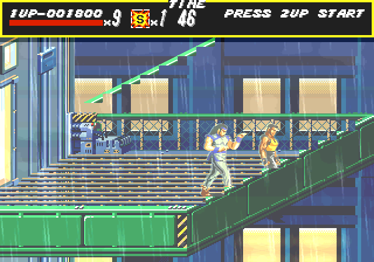<br><sub><b>Weather</b>: rain and a strike on the Round 7 lift</sub></td>
<td align="center">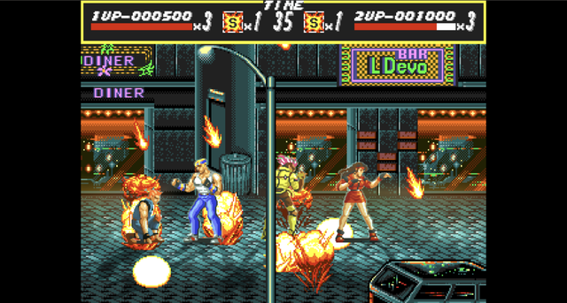<br><sub><b>In Flycast</b>: the two-player demo with the bazooka</sub></td>
</tr>
<tr>
<td align="center">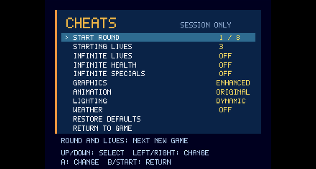<br><sub><b>Options menu</b> (L + R): cheats and the graphics switches</sub></td>
<td></td>
</tr>
</table>

### All eight rounds, enhanced

<table>
<tr>
<td align="center">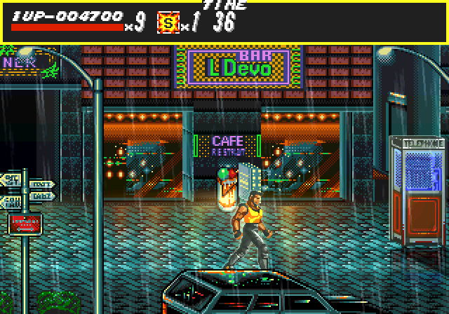<br><sub><b>Round 1</b>: rain, wet street, shop windows and neon as lights</sub></td>
<td align="center">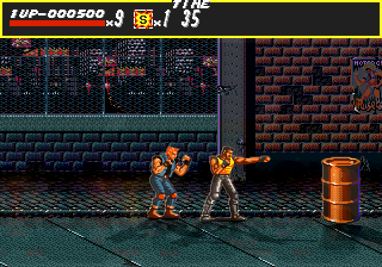<br><sub><b>Round 2</b>: wet ground under the bridge</sub></td>
</tr>
<tr>
<td align="center">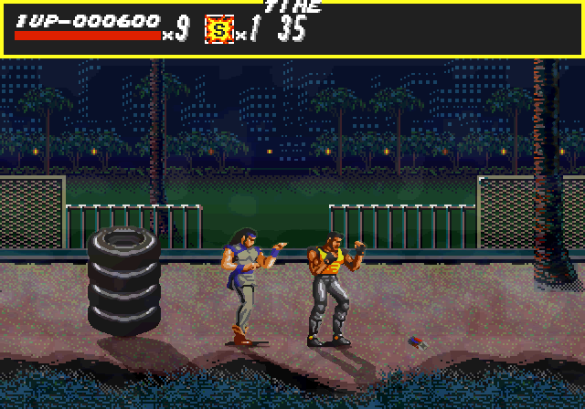<br><sub><b>Round 3</b>: mist on the beach</sub></td>
<td align="center">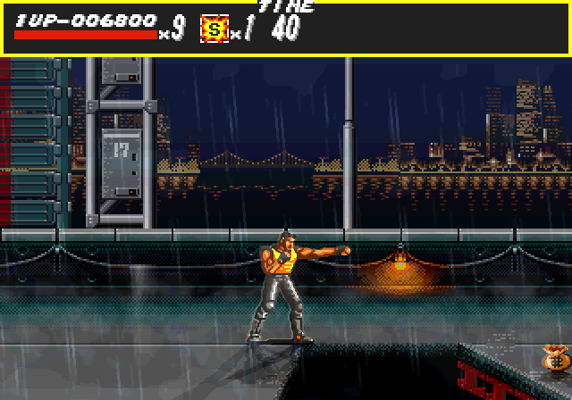<br><sub><b>Round 4</b>: rain, mist and lamp pools on the bridge</sub></td>
</tr>
<tr>
<td align="center">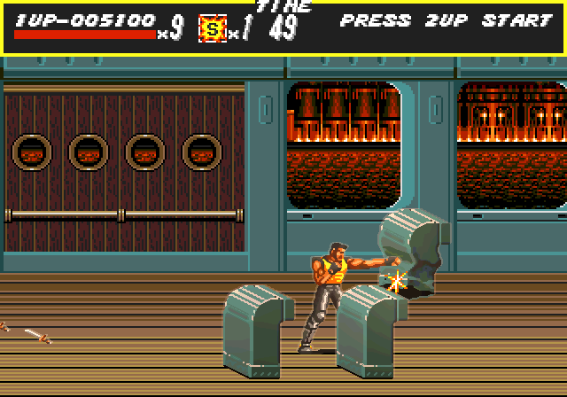<br><sub><b>Round 5</b>: the ship, lit from its windows</sub></td>
<td align="center">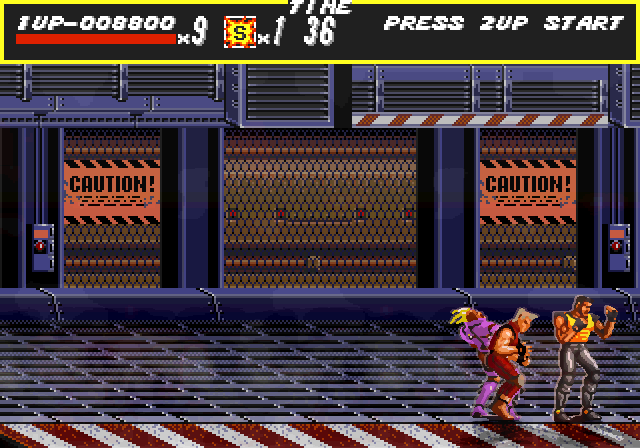<br><sub><b>Round 6</b>: steam in the factory</sub></td>
</tr>
<tr>
<td align="center">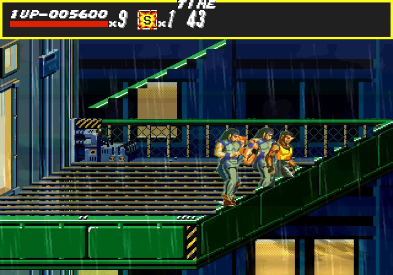<br><sub><b>Round 7</b>: rain on the lift</sub></td>
<td align="center">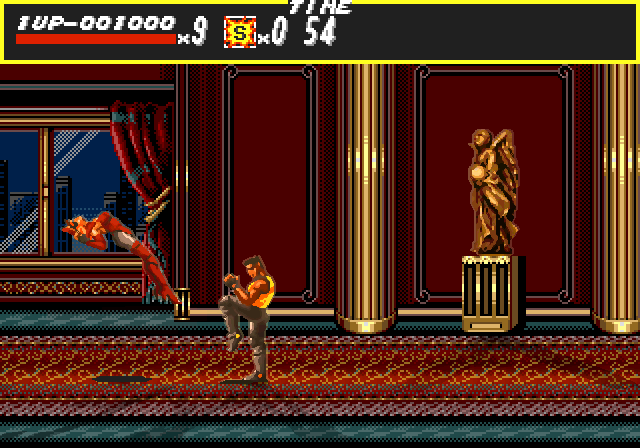<br><sub><b>Round 8</b>: the mansion</sub></td>
</tr>
</table>

Gameplay frames are from the host preview of the enhanced renderer (the same
integer scene the Dreamcast draws; see [docs/REMASTER.md](docs/REMASTER.md));
the menu and the two-player demo are Flycast window captures. Smooth animation
is not shown: it needs motion, and few in-between poses exist yet.

## Status

- Round 1 matches the original ROM frame for frame in emulation, including the
  boss, weapons, continue/game over and two-player play
  ([docs/FIDELITY_GATE.md](docs/FIDELITY_GATE.md)). Rounds 2–8 run to the
  ending but have not been compared with the original.
- The enhanced art is generated from the original frames; hand-drawn art is
  not started. Smooth animation has few in-betweens yet.
- Full speed with no audio dropouts in Flycast. **Not yet tested on a real
  Dreamcast** — I have ordered one and will try it when it arrives; that said,
  feedback is welcome if someone wants to try it beforehand.

## What you need

- **The ROM**: Streets of Rage / Bare Knuckle (World), revision 00, 524,288 bytes,
  as a plain big-endian Mega Drive dump (no header, not byte-swapped).
  SHA-256 `dd44f120446654bb91c448762f3e0cd0d9b034f35d0e3266a4dc34402ada95c0`.
  Other revisions are rejected. Put it here:

  ```text
  original_rom/Bare Knuckle - Ikari no Tetsuken ~ Streets of Rage (World).md
  ```

  Or pass its path as the first argument to the build scripts.
- **KallistiOS** with an SH-4 GCC that includes C++ (`enable_cpp=1` in kos-chain).
  The scripts source `~/.local/share/dreamcast/kos/environ.sh`; set `KOS_ENV` if
  yours is elsewhere. Versions used: [docs/TOOLCHAIN.md](docs/TOOLCHAIN.md).
- **mkdcdisc** ([gitlab.com/simulant/mkdcdisc](https://gitlab.com/simulant/mkdcdisc))
  to make the disc image. Expected at `build/mkdcdisc/build/mkdcdisc`, or set
  `MKDCDISC`.
- **Python 3.14** (`python3.14` on the path, or set `PYTHON`) for code generation.
- **Flycast**, or a Dreamcast with a GDEMU (or similar) or a burned CD-R.
  `tools/run-flycast.sh` launches Flycast on macOS, looking for `Flycast.app`
  in `~/.local/share/dreamcast/flycast/` then `/Applications/` (set
  `FLYCAST_BIN`).

To see what is set up and what is missing, with where to get each thing:

```bash
tools/check-requirements.sh all
```

The build scripts run the same checks. The first build also clones the research
repositories listed in `tools/upstream-lock.json` into `research/`.

## Build a disc image

```bash
./build-cdi.sh
```

This writes `dist/sor.cdi`. Copy it to your GDEMU card, burn it, or load it in
Flycast; on macOS:

```bash
./tools/run-flycast.sh dist/sor.cdi
```

`dist/` contains your game data; don't share it.

## Quick run without a disc

Builds an ELF with the ROM embedded and launches it in Flycast (macOS):

```bash
./build-and-run.sh
```

Flycast starts muted; `FLYCAST_MUTE=0 ./build-and-run.sh` plays sound. Serial
output goes to `build/logs/flycast.log`.

## Enhanced graphics

The art package is built from your ROM (about two minutes):

```bash
tools/build-headless.sh
tools/build-profile-core.sh
python3 -m venv build/tools-venv && build/tools-venv/bin/pip install numpy pillow
tools/make-art-set.sh
```

Once `build/art/SORART.PAK` exists, `build-cdi.sh` puts it on the disc and
`build-and-run.sh` embeds it in the ELF. The disc build starts in original
graphics unless built with `SOR_ENHANCED=1`; `build-and-run.sh` starts enhanced
unless `SOR_ENHANCED=0`. Using your own art: [docs/REMASTER.md](docs/REMASTER.md).

## Controls

| Dreamcast | Action |
| --- | --- |
| D-pad | Move |
| X | Attack |
| A | Jump |
| Y | Police special |
| Start | Menus / pause |
| L + R | Options menu |

The same mapping works on port B for player 2.

**L + R** opens the options menu at any time, including mid-game (the game
pauses). Up/down selects, left/right or A changes, B / Start / L + R closes.

- **Start round** (1–8) and **starting lives** (1–9), for the next new game.
- **Infinite lives / health / specials**, for both players.
- **Graphics** (original / enhanced), **Animation** (original / smooth),
  **Lighting** (original / dynamic), **Weather** (off / on).
- **Restore defaults.**

Settings last for the session. Dynamic lighting is on by default (with enhanced
graphics); `SOR_LIGHTING=0` at build time starts without it. `SOR_SMOOTH=1` and
`SOR_WEATHER=1` start with those options on.

## Tests

```bash
./tools/test.sh
python3 tools/test-rom.py
python3 tools/test-generation.py
./tools/test-scene.sh
```

Comparisons against the original ROM and benchmarks:
[docs/REFERENCE.md](docs/REFERENCE.md), [docs/CADENCE.md](docs/CADENCE.md),
[docs/AUDIO.md](docs/AUDIO.md), [docs/OPTIMIZATION_LOG.md](docs/OPTIMIZATION_LOG.md).
Progress: [docs/PROGRESS.md](docs/PROGRESS.md). Hardware checklist:
[docs/HARDWARE_TESTS.md](docs/HARDWARE_TESTS.md).

## Licence

Original code in this repository is [MIT](LICENSE). The research repositories
and runtime keep their own [notices](licenses). The game, its ROM and anything
generated from it (translated code, extracted frames, art packages, disc images)
are not covered by this licence and must not be redistributed.
